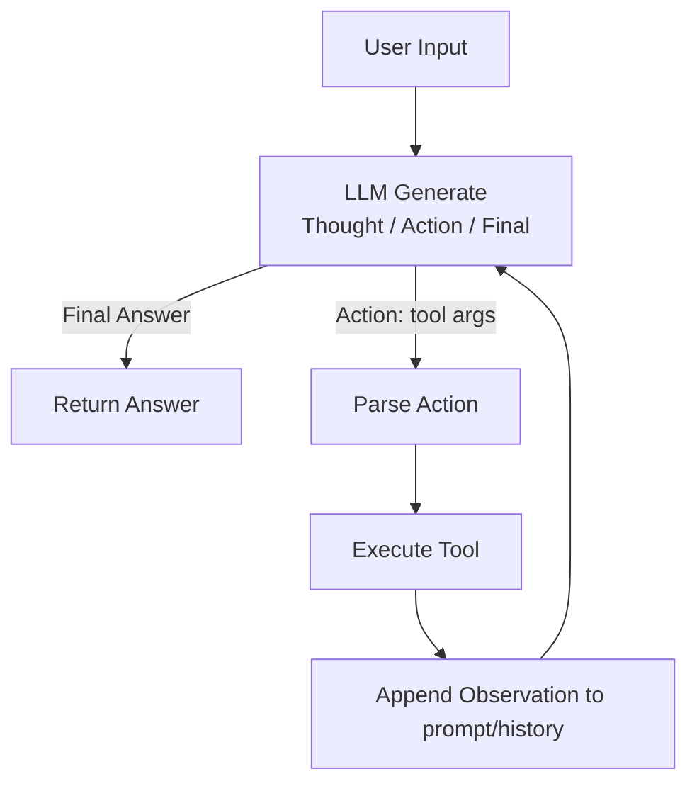

# Group Report: Lab 3 - Production-Grade Agentic System

- **Team Name**: BanZ
- **Team Members**: Nguyễn Đình Hiếu, Trần Văn Tuấn, Lê Văn Tùng, Hồ Bảo Thư, Lê Thanh Thưởng
- **Deployment Date**: 2026-04-06
-**Github**: https://github.com/FWD-LeTung/ReAct-Agent.git
---

## 1. Executive Summary

Mục tiêu của hệ thống là chuyển từ Chatbot “trả lời” sang ReAct Agent “hành động”: biết **gọi tool**, đọc **Observation**, và lặp lại đến khi ra **Final Answer**, đồng thời có **telemetry JSON logs** để debug theo trace.

- **Success Rate**: **11/24 (45.83%)** trên các prompt thử nghiệm ghi nhận trong `logs/2026-04-06.log`.
- **Key Outcome**: Agent giải được các câu hỏi nhiều bước kiểu “**tra lãi suất → tính tiền lãi**” nhờ gọi tool + dùng Observation thay vì suy đoán, và khi thất bại vẫn để lại trace rõ ràng để RCA.

---

## 2. System Architecture & Tooling

### 2.1 ReAct Loop Implementation

Luồng ReAct triển khai trong `src/agent/agent.py`:



Các điểm kỹ thuật chính:
- Parse `Action: tool_name(...)` bằng regex.
- Parse args ưu tiên JSON (object/array/scalar), fallback string.
- Log theo từng step: `AGENT_START`, `AGENT_STEP`, `TOOL_OBSERVATION`, `AGENT_FINAL`, `AGENT_END`.
- Giới hạn vòng lặp `max_steps` để tránh loop vô hạn.

### 2.2 Tool Definitions (Inventory)

| Tool Name | Input Format | Use Case |
| :--- | :--- | :--- |
| `fetch_interest_rates` | `json` | Cào bảng lãi suất từ `webgia.com` và trả về CSV string (phục vụ so sánh lãi suất). |
| `calculate` | `json` | Tính tiền lãi/tiền nhận (lãi đơn, lãi kép, rút trước hạn, rút một phần). |

### 2.3 LLM Providers Used

- **Primary**: OpenAI (`gpt-4o`) qua `src/core/openai_provider.py`
- **Secondary (Backup / Experiment)**: Gemini (qua `src/core/gemini_provider.py`) trong giai đoạn thử nghiệm

---

## 3. Telemetry & Performance Dashboard

Nguồn telemetry: `logs/2026-04-06.log` (event `LLM_METRIC`).

- **Average Latency (P50)**: **2522ms**
- **Max Latency (P99 ~ Max)**: **6623ms**
- **Average Tokens per Task (avg total_tokens/request)**: **945.18**
- **Total Cost of Test Suite (mock estimate)**: **0.10397**
- **Provider mix**: `google`: 8 requests, `openai`: 3 requests

Ngoài ra, nhóm đã thêm test tự động bằng `pytest` để kiểm tra:
- tool tính toán (`src/tools/calculate.py`)
- ReAct loop với fake LLM (`src/agent/agent.py`)
- runner `run_agent.py` (monkeypatch để không phụ thuộc network)

Kết quả: `pytest -q` → **12 passed** (warnings hiện tại chủ yếu đến từ `datetime.utcnow()` trong logger).

---

## 4. Root Cause Analysis (RCA) - Failure Traces

### Case Study 1: Tool dependency missing (Playwright browser not installed)

- **Input**: “tìm ngân hàng có lãi suất cao nhất ở Việt Nam hôm nay”
- **Action**: `fetch_interest_rates({"bank_name":"all","type_rate":"all"})`
- **Observation** (trích log): Tool trả lỗi thiếu browser executable và yêu cầu chạy `playwright install`.
- **Root Cause**: Môi trường chạy thiếu Playwright browser binaries (runtime dependency), không phải lỗi prompt/logic.
- **Fix / Mitigation**:
  - Cài browser: `playwright install`
  - (Production-hardening) fallback/guardrail: nếu Observation chứa “playwright install”, agent trả hướng dẫn setup và dừng sớm thay vì tiếp tục suy đoán.

**Log excerpt (trace 7 dòng)** từ `logs/2026-04-06.log`:

```text
{"timestamp":"2026-04-06T10:30:37.112474","event":"AGENT_START","data":{"input":"tìm ngân hàng có lãi suất cao nhất ở Việt Nam hôm nay","model":"gpt-4o"}}
{"timestamp":"2026-04-06T10:30:39.341806","event":"LLM_METRIC","data":{"provider":"openai","model":"gpt-4o","total_tokens":313,"latency_ms":2228}}
{"timestamp":"2026-04-06T10:30:39.341806","event":"AGENT_STEP","data":{"step":1,"llm_output":"...\\nAction: fetch_interest_rates({\"bank_name\":\"all\",\"type_rate\":\"all\"})"}}
{"timestamp":"2026-04-06T10:30:39.880648","event":"TOOL_OBSERVATION","data":{"step":1,"tool":"fetch_interest_rates","observation":"... Executable doesn't exist ... Please run ... playwright install ..."}}
{"timestamp":"2026-04-06T10:30:42.885177","event":"LLM_METRIC","data":{"provider":"openai","model":"gpt-4o","total_tokens":545,"latency_ms":3004}}
{"timestamp":"2026-04-06T10:30:42.885177","event":"AGENT_STEP","data":{"step":2,"llm_output":"(cannot fetch rates due to tool failure) ..."}}
{"timestamp":"2026-04-06T10:30:42.885177","event":"AGENT_END","data":{"steps":2,"reason":"no_action_no_final"}}
```

### Case Study 2: Model/provider mismatch (404 model not found)

- **Symptom**: Chạy OpenAI nhưng `.env` để `DEFAULT_MODEL=gemini-...` → OpenAI trả `model_not_found`.
- **Root Cause**: Config drift khi chuyển provider trong quá trình lab.
- **Fix**: Runner chuẩn hoá model cho OpenAI (fallback về `gpt-4o` khi phát hiện model bắt đầu bằng `gemini`).

### Case Study 3: Quota / Billing (429 insufficient_quota)

- **Symptom**: OpenAI trả `429 insufficient_quota`.
- **Root Cause**: Hết quota / billing chưa hợp lệ trên tài khoản.
- **Fix**: Bật billing / đổi key / hoặc chuyển provider (Gemini/local) để tiếp tục test.

---

## 5. Ablation Studies & Experiments

### Experiment 1: Tool-call formatting robustness (v1 → v2)

- **Diff**:
  - v1: model đôi khi gọi tool theo dạng `tool(arg1=..., arg2=...)` (không phải JSON) gây mismatch.
  - v2: ép guideline “prefer JSON args” trong system prompt + parser args hỗ trợ JSON-first để giảm lỗi format.
- **Result**:
  - Giảm lỗi kiểu “tool argument mismatch” và tăng khả năng loop tiếp theo dùng Observation chính xác.

### Experiment 2: Chatbot vs Agent (qualitative)

| Case | Chatbot Result | Agent Result | Winner |
| :--- | :--- | :--- | :--- |
| **Simple Q&A**: “hi” | Trả lời ngay (1 bước) | `gpt-4o` trả lời ngay, agent không cần tool (log: `AGENT_END reason=no_action_no_final`) | **Draw** |
| **Multi-step**: “compute interest” | Thường phải tự tính trong text, dễ sai khi nhiều điều kiện | Agent gọi tool `calculate` và kết thúc bằng `Final Answer` (log có `AGENT_FINAL`) | **Agent** |
| **Tool failure**: “tìm ngân hàng có lãi suất cao nhất … hôm nay” | Có thể trả lời chung chung/khuyên xem website | Agent gọi `fetch_interest_rates` nhưng thất bại do thiếu Playwright browser; trace rõ ràng và hướng khắc phục cụ thể | **Chatbot (robust)** |

**Log excerpt (success multi-step)** từ `logs/2026-04-06.log`:

```text
{"timestamp":"2026-04-06T14:22:32.587379","event":"AGENT_START","data":{"input":"compute interest","model":"fake-model"}}
{"timestamp":"2026-04-06T14:22:32.594751","event":"AGENT_STEP","data":{"step":1,"llm_output":"... Action: calculate({\"amount\":100000000,\"rate\":6.0,\"duration\":12})"}}
{"timestamp":"2026-04-06T14:22:32.595275","event":"TOOL_OBSERVATION","data":{"step":1,"tool":"calculate","observation":"{'type': 'normal', 'interest': 6000000.0, 'total': 106000000.0}"}}
{"timestamp":"2026-04-06T14:22:32.595739","event":"AGENT_STEP","data":{"step":2,"llm_output":"Final Answer: done"}}
{"timestamp":"2026-04-06T14:22:32.595851","event":"AGENT_FINAL","data":{"step":2,"final":"done"}}
{"timestamp":"2026-04-06T14:22:32.595926","event":"AGENT_END","data":{"steps":2}}
```

---

## 6. Production Readiness Review

- **Security**:
  - Không hardcode API key trong code; dùng `.env`.
  - Validate input args trước khi gọi tool (đặc biệt tool crawl web) để giảm rủi ro injection/SSRF.

- **Guardrails**:
  - `max_steps` để giới hạn vòng lặp/cost.
  - Phân loại lỗi tool (timeout/dependency missing) để phản hồi có hướng dẫn thay vì loop.

- **Scaling**:
  - Chuẩn hoá output tools sang JSON schema thay vì CSV string dài.
  - Cache kết quả crawl theo ngày để giảm latency và cost.
  - Nếu số tool tăng, dùng tool-router (retrieval) hoặc framework graph (ví dụ LangGraph) để branching rõ ràng.

---
